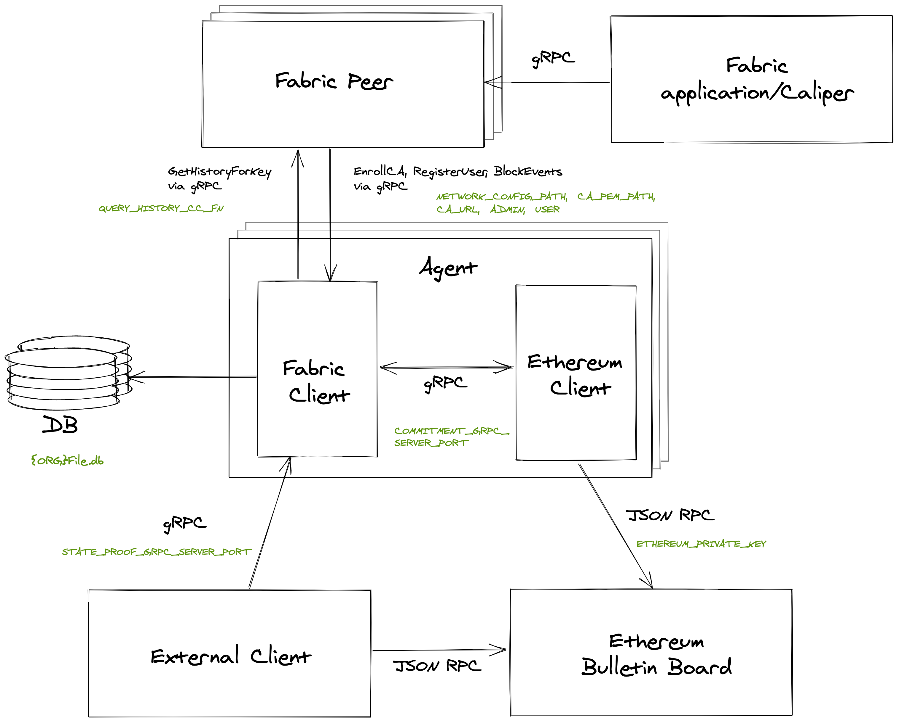

# State Commitment Agent

The state commitment agent is used to maintain a commitment of the entire state
of a Fabric ledger in an RSA accumulator. The accumulator is periodically
published to a public bulletin board, the Ethereum mainnet. The agent can be
queried by an external agent to retrieve state and a proof of membership of that
state in the accumulator.

This project has two modules:

1. The Fabric client is a process that subscribes to block events coming from the Fabric
   peer. It also maintains the accumulator and runs a gRPC server for the
   external client to make requests to.
2. The Ethereum client runs as a separate process and connects to the Ethereum
   network to publish commitments. It runs a gRPC server to receive commitments
   from the Fabric process.

A very rough architecture of the system is shown below. Some of the variables
required to be set in the config files are shown in green.



## Prerequisites

### Build the RSA accumulator library and publish to MavenLocal

The commitment agent uses the
[rsa-accumulator-kotlin](https://github.com/dlt-interoperability/rsa-accumulator-kotlin)
library to maintain an RSA accumulator of the entire state of the Fabric ledger.
This repository needs to be cloned, built, and published to a local Maven
repository. Follow instructions in the repo to do this. **Change line 21 in the
`build.gradle` to point to your local Maven repository directory.**

### Update the config properties

There needs to be a config file corresponding to each agent that will be
connecting to a Fabric peer. The
`fabric-client/src/main/resources/config.properties` file can be used as a
template to a new file called `<orgId>config.properties`. The file needs to be
updated with the correct information. Take extra special care with those in
bold.

- The host and port of the gRPC server that will be running to receive state and
  proof requests from the external client. (`STATE_PROOF_GRPC_SERVER_HOST` and
  **`STATE_PROOF_GRPC_SERVER_PORT`**).
- The host and port of the gRPC server of the Ethereum client component of the
  agent that the Fabric client will be communicating with.
  (`COMMITMENT_GRPC_SERVER_HOST` and **`COMMITMENT_GRPC_SERVER_PORT`**).
- The path to the connection json file of the peer
  (**`NETWORK_CONFIG_PATH`**) and the path to the peer organization's CA
  certificate (**`CA_PEM_PATH`**).
- The chaincode installed on the network must have a function that returns the
  result of the `GetHistoryByKey` stub function. This allows the agent to query
  the peer for the history of the state requested by the external client to find
  the version that was included in the version of the accumulator they requested
  for. The name of this function should be provided in the **`QUERY_HISTORY_CC_FN`**
  variable.
- The **`ORG`** variable is used to name the DB file that the accumulator is stored
  in. It should be consistent with the name used when naming the config file,
  to start the fabric-client and the ethereum-client, and when specifying the
  org to connect to as the external-client.
- **`CA_URL`** is the address of the certificate authority for the organization.
- **`ADMIN`** is used in the name of the file for the admin credentials issued by the CA. It
  needs to be specific for the organization, e.g. "org1Admin".
- `HOSTNAME` is used by the EnrollmentRequest when enrolling the admin user and
  to be honest, I'm not actually sure what it's for. Leave as `localhost` unless
  you know better.
- `MSP` is the name of the MSP for the organization and is included in the
  issued certificate for the admin and user.
- **`USER`** is used in the name of the file for the user credentials issued by the
  CA. It needs to be specific for the organization and must end in "User", e.g. `org1User`.
- `AFFILIATION` is one of the properties of the user and is used in the
  registration request. I don't think this matters too much.
- The seeds used for trusted setup of the accumulator. These seeds are used to
  create the large random primes `p` and `q` that are used to generate the RSA
  modulus `N` for the accumulator, and for random base of the accumulator `A0`.
  These seeds can be any `Long`, but must be the same between all agents.

There also needs to be a config file for each agent to tell it how to connect to
the Ethereum network. The
`ethereum-client/src/main/resources/config.properties` file can be used as a
template to a new file called `<orgId>config.properties`. The file needs to be
updated with the correct information. Take extra special care with those in
bold.

- `ETHEREUM_ACCOUNTS` is the list of Ethereum account addresses used by the
  Fabric agents that are comma separated with no spaces. The `config.properties`
  file lists the first five addresses that are printed when the Ethereum network
  is started with `npx ganache-cli --deterministic`. When setting the management
  committee the first _n_ addresses will be taken from this list, where _n_ is
  the number of Fabric user credentials present in the `wallet` folder. Only
  change this list if a different set of Ethereum accounts is used, or if more
  than five addresses are needed.
- **`ETHEREUM_PRIVATE_KEY`** is the private key used by this agent. Each agent
  that is started needs to use a unique private key. It must correspond with one
  of the Ethereum accounts that is included in the managment committee. For
  example, if it is a three org network, there will be three sets of user
  credentials in the `wallet` folder. Therefore, three Fabric public keys and
  the first three accounts in the `ETHEREUM_ACCOUNTS` list will be submitted as
  the management commitee. The first three private keys need to be listed in the
  three config files corresponding to the three orgs.
- **`POLICY_QUORUM`** is the number of votes a commitment needs to be activated
  on the bulletin board. Update this if there are multiple Fabric agents and you
  want them all to submit commitments.
- `COMMITMENT_GRPC_SERVER_HOST` and **`COMMITMENT_GRPC_SERVER_PORT`** define the
  address of the gRPC server that the ethereum-client runs to receive
  commitments from the Fabric client. Each set of fabric-client and
  ethereum-client pairs need to use a distinct port, but it must be the same
  port as the one listed in the corresponding config file in fabric-client.

### Clone the bulletin board repo and start the Ethereum network

This project copies the solidity smart contracts defined in the [bulletin
board](https://github.com/dlt-interoperability/bulletin-board) repo and
generates Java wrapper files from them. Ensure the bulletin board project is
present at the same level as the directory structure as the commitment-agent
project.

Before starting the The Ethereum bulletin board run, `npm install`. Then run:

```
npx ganache-cli --deterministic
```

### Start the Fabric network

This Fabric agent can be used with any Fabric network as long as the
[appropriate config files](#update-the-config-properties) have been created and
the installed chaincode has implemented a function that returns the result of
the `GetHistoryByKey` stub function. Examples of how to implement this
stub function is shown in the [JavaScript Gist](https://gist.github.com/airvin/f9ea089ed5e9658f962ac8e77aedff6d)
and [Go Gist](https://gist.github.com/airvin/cfae11911070c08fc7ce0e8a797d0015). An
example [Fabric network](https://github.com/dlt-interoperability/fabric-network)
is also available that comes complete with chaincode and application. Start this
example Fabric network and deploy and invoke the chaincode with:

```
make start
make deploy-cc
make invoke-cc
```

The `invoke-cc` make target starts a Fabric node.js application that submits
`CreateAsset` transactions every 10 seconds. This can be cancelled with
`ctrl-c`. The `make invoke-cc` can be used repeatedly without needing to
restart the network.

## Start the Fabric agent

Only one of the Ethereum clients needs to deploy the ledger state contract.
Start the first peer's Ethereum client, then copy the ledger
contract address printed and use it when starting the second peer's Ethereum
client in a separate terminal pane.

```
make start-ethereum ORG="org1"
make start-ethereum ORG="org2" LC_ADDRESS="<lc-address>"
```

The credentials for both the Fabric clients need to be generated before
submitting the management committee to the ledger state contract. Therefore, the
second client that is started should have the `INIT="true"` flag, which tells
the client that it should look up all the user public keys in the wallet folder
and submit them as the management committee to the ledger state Ethereum
contract. In separate terminal panes, run:

```
make start-fabric ORG="org2"
make start-fabric ORG="org1" INIT="true"
```

**Note on restarting the agent**: If the Fabric network is stopped and started,
the user and admin credentials for the agents need to be deleted so they can be
reissued by the Fabric network CA. This can be done with:

```
make clean
```

### Making queries from the external client

The [external client](https://github.com/dlt-interoperability/external-client)
is a command line application that can make requests to the agent. To do so,
clone the repo, update path to local Maven repository and build the binary with:

```
./gradlew installDist
```

The command has the structure: `get-proof <state-key> <ledger-state-contract-address> <fabric-org-id>`. The state key is the key for
any state that exists in the Fabric network's ledger. The org id needs to be the
same as the org id used to start the ethereum and fabric clients. For example:

```
./build/install/external-client/bin/external-client get-proof key1 0xe78a0f7e598cc8b0bb87894b0f60dd2a88d6a8ab org1
```

### Troubleshooting gRPC

[BloomRPC](https://github.com/uw-labs/bloomrpc) can be used if the gRPC server
needs to be tested from a dummy client. BloomRPC is like Postman for gRPC.

## Coding principles

This codebase uses functional programming principles as much as possible. A
functional library for Kotlin, called [Arrow](https://arrow-kt.io/docs/core/) is
used, primarily for error handling with the `Either` type.

Conventions:

- Use immutable state.
- Catch exceptions as close as possible to their source and convert to [Arrow's
  `Either`
  type](https://arrow-kt.io/docs/apidocs/arrow-core-data/arrow.core/-either/).
- Implement functions as expressions. Flows that produce errors can be composed
  using `map`, `flatMap` and `fold`. Avoid statements with side effects in functions.
- Use recursion over loops (when tail recursion is possible to improve performance and avoid stack overflow).

Example Gists:

- [How to catch exceptions and convert to and Either type](https://gist.github.com/airvin/79f1fb2a3821a9e5d227db3ee9561f42).
- [Using flatMap to compose functions that return Eithers](https://gist.github.com/airvin/3bfae1f3e622e466ba9072b53684555a).
- [Folding over an Either Error to reduce to a single type](https://gist.github.com/airvin/eabc99a9552a0573afd2dd9a13e75948).

## TODO

Fabric

- Have the creation the user and admin credentials and the submission of the
  management committe to the Ethereum contract run separately.

RSA Accumulators

- Add a config file to store path to local Maven repository for the
  `build.gradle` file.
- Update function should trigger the Ethereum publication function every _k_
  blocks (with signature). Currently, it is triggering publication on every
  block.

Ethereum Client

- Fix the type of the commitment on the bulletin board to fit the entire commitment

General

- Fix the architecture diagram
- Add sequence diagrams for
  - Setting up management committee
  - Updating and publishing commitment
  - Making request
